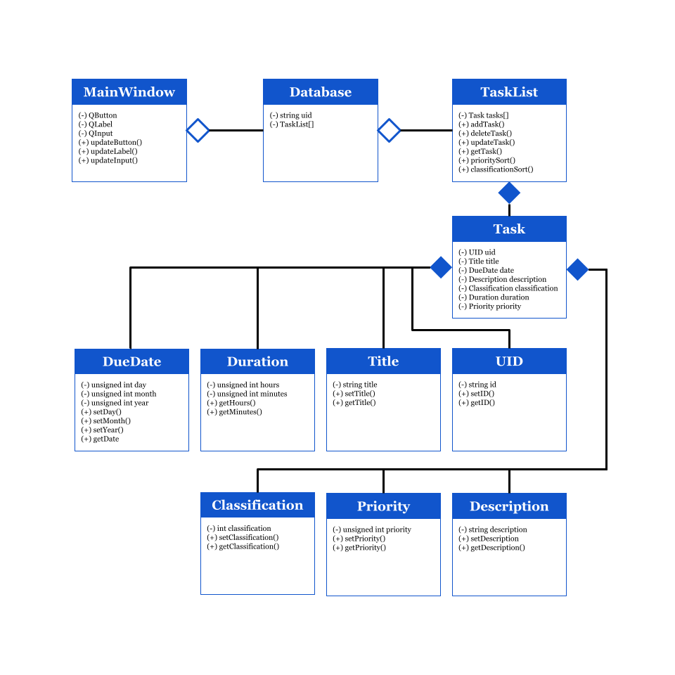

# Task Scheduler
 
 Authors: [Aakash Gnanakumar](https://github.com/Aakash-agnan001), [Divyank Shah](https://github.com/shahdivyank), [Alan Zhao](https://github.com/azhao036), [Marcus Hickman](https://github.com/MarcusAHickman)
 
## Project Description
As college students, it is very difficult to juggle assingments, reports, classes, work, student organizations and many times we are likely to forget important deadlines and events we need to tend to. We need a tool or some method to be able to organize these tasks into an easily accessible and displayed view for us to understand various tasks at hand and the urgency we must deal with them. A task scheduler with various pieces of information including due dates, priority, duration, and the type of task will help to better organize ourselves as we attempt to balance many activites and assignments.  

## Technologies Used
* C++ (Primary development language)
* [QT Creator](https://www.qt.io)
    * Utilize QT (GUI) to display current tasks
    * Interface using C++ 
        * Buttons to interact with backend to add/delete/store data

## Expected Project Output
* A user should be able to enter information about a current task they have and include the followinig information: title, description, due date, classification, duration, and priority. Once added, the display will upate to show their current tasks they need to work on. Once a task has been completed they can mark the task as completed and continue to work on their other tasks. If the user has made a mistake when creating their tasks or needs to update a certain task, they should be able to by editing the current task. 

## UML Class Diagram

 
## Design Pattern: Strategy Pattern
We used the strategy pattern, as our algorithms and methods were very similar with minimal changes between each implementation. Given our intial iteration of our design pattern, we were able to see that the strategy pattern would be the most benficial for our numerous classes required. Using this feature we were able to implement an interface class <i>Information</i> and then proceeded to create the <i>UID, Description, Priority, Classification, Title, Duration, DueDate</i> classes that inherited from the <i>Information</i> class and defined the setInformation and getInformation methods, along with any special functions that class may require! However, we ran into the problem of varying return types among the function. To resolve this, we resorted to a combination of the Strategy and Visitor pattern. The Visitor pattern allows us to keep multiple iterations of a method and simply change the parameters or return type to prevent the methods types being determined at runtime but rather statically. These design patterns made it clear that all the various classes were related in terms of the methods they will be implementing. It also made it easier to be able to easily work with the Task class, as everything was consitent and easy to follow and test! 
 
 > ## Final deliverable
 > All group members will give a demo to the TA/reader during lab time. The TA/reader will check the demo and the project GitHub repository and ask a few questions to all the team members. 
 > Before the demo, you should do the following:
 > * Complete the sections below (i.e. Screenshots, Installation/Usage, Testing)
 > * Plan one more sprint (that you will not necessarily complete before the end of the quarter). Your In-progress and In-testing columns should be empty (you are not doing more work currently) but your TODO column should have a full sprint plan in it as you have done before. This should include any known bugs (there should be some) or new features you would like to add. These should appear as issues/cards on your Project board.
 > * Make sure your README file and Project board are up-to-date reflecting the current status of your project (e.g. any changes that you have made during the project such as changes to your class diagram). Previous versions should still be visible through your commit history. 
 
 ## Screenshots
 > Screenshots of the input/output after running your application
 ## Installation/Usage
 > Instructions on installing and running your application
 ## Testing
 > How was your project tested/validated? If you used CI, you should have a "build passing" badge in this README.
 
