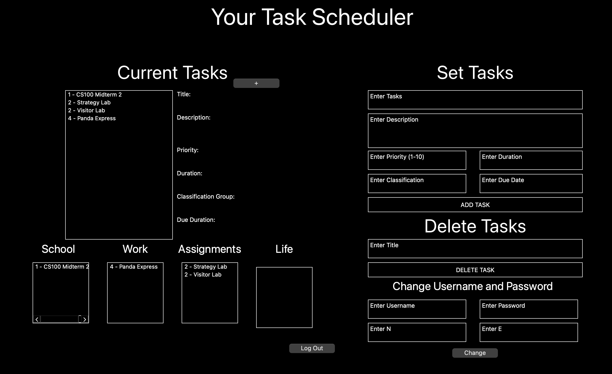

# Task Scheduler
 
 Authors: [Aakash Gnanakumar](https://github.com/Aakash-agnan001), [Divyank Shah](https://github.com/shahdivyank), [Alan Zhao](https://github.com/azhao036), [Marcus Hickman](https://github.com/MarcusAHickman)
 
## Project Description
As college students, it is very difficult to juggle assingments, reports, classes, work, student organizations and many times we are likely to forget important deadlines and events we need to tend to. We need a tool or some method to be able to organize these tasks into an easily accessible and displayed view for us to understand various tasks at hand and the urgency we must deal with them. A task scheduler with various pieces of information including due dates, priority, duration, and the type of task will help to better organize ourselves as we attempt to balance many activites and assignments.  

## Technologies Used
* C++ (Primary development language)
* [QT Creator](https://www.qt.io)
    * Utilize QT (GUI) to display current tasks
    * Interface using C++ 
        * Interactively engage user to add, update, complete tasks

## Expected Project Output
* A user should be able to enter information about a current task they have and include the followinig information: title, description, due date, classification, duration, and priority. Once added, the display will upate to show their current tasks they need to work on. Once a task has been completed they can mark the task as completed and continue to work on their other tasks. If the user has made a mistake when creating their tasks or needs to update a certain task, they should be able to by editing the current task. 

## UML Class Diagram

 
## Design Pattern: Strategy Pattern
We used the strategy pattern, as our algorithms and methods were very similar with minimal changes between each implementation. Given our intial iteration of our design pattern, we were able to see that the strategy pattern would be the most benficial for our numerous classes required. Using this feature we were able to implement an interface class <i>Information</i> and then proceeded to create the <i>Description, Priority, Classification, Title, Duration, DueDate</i> classes that inherited from the <i>Information</i> class and defined the setInformation and getInformation methods, along with any special functions that class may require! These design patterns made it clear that all the various classes were related in terms of the methods they will be implementing. It also made it easier to be able to easily work with the Task class, as everything was consitent and easy to follow and test! 
 
 ## Installation/Usage
To install and use the program, ensure you have `QT` and `qmake` installed.

## For Mac using homebrew
Install homebrew if not already installed
```
$ /bin/bash -c "$(curl -fsSL https://raw.githubusercontent.com/Homebrew/install/HEAD/install.sh)"
```
Update homebrew and install `qmake`
```
$ brew update
4 brew upgrade
$ brew install qt
```
To check that `qmake` has been properly installed run 
```
$ qmake -v
```
Clone the project recursively to include the GTEST submodule for unit testing
```
$ git clone --recursive https://github.com/cs100/final-project-error-404.git
$ cd final-project-error-404
```
Finally to compile and run the project run:
```
$ qmake scheduler.pro
$ make
$ open scheduler.app
```
Make sure to change the file path of the `data.txt` file in `mainwindow.cpp`.

## For Windows
Clone the project recursively to include the GTEST submodule for unit testing
```
$ git clone --recursive https://github.com/cs100/final-project-error-404.git
$ cd final-project-error-404
```

Install `QT Creator` from the official website and download the software. During the installation process, be ensure to install `QT for Desktop Environment` the other options are optional. Once successfully installed, open a project and navigate to the `scheduler.pro` file. Configure the project using the default desktop kit. Once the project is finished configuring, in the bottom left hand corner, there is a green play button to run the project. Make sure to change the file path of the `data.txt` file in `mainwindow.cpp`.

## Usage
When the user first opens the application, the user is greeted with a login page. The user will need to put in the correct credientials to be able to login. The default credientials are `admin` for username `admin` for passwor `1649` for `n` and `5` for `e`. The user can later change them once they have logged in. If the user inputs invalid credientials, the system will not allow them to login. 
<br><br>


Once the user is logged in, they will be greeted with an interface to visualize their tasks. If the user is logging in for the first time, there will be no tasks present. However, since the data is saved, the user can always trust that their data will be available even if they close the application. From here, the user can input new tasks filling out the required fields or delete tasks they have already completed. Tasks are automatically sorted by priority as well as by classification depending on the index provided (1 - 4).
<br><br>


If the user needs to change details about a given task, they can simply click on the task, and change the input fields to match the desired information. You can also use the task display to view more details about a given task.
<br><br>


 ## Testing
 The project is tested using the GTEST framework. All fundamental classes were tested throughly to ensure minimal errors. Unit tests attempt to cover edge cases as well, including invalid input and no input, ensuring that the code would respond exactly the way it was intended. Additional details about the test cases can be found in `unit_test.cpp` inside the `Tests` subdirectory

 To run unit tests, ensure that you have cmake installed through. Then proceed to run cmake on the project and run the executable
```
$ cmake .
$ make
$ ./unit_tests
```

